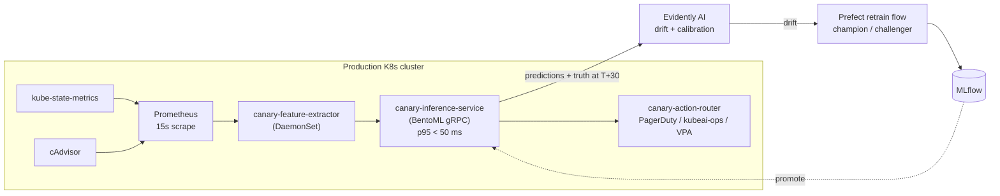

# cluster-canary

[](https://github.com/sharankumarreddyk/cluster-canary/actions/workflows/ci.yml)
[](https://www.python.org/downloads/)
[](LICENSE)

**Predict Kubernetes pod failures (OOMKill, CrashLoopBackOff) before they happen — and act on the prediction.**

A proactive ML layer for cluster health. Pairs with [`kubeai-ops`](https://github.com/sharankumarreddyk/kubeai-ops) (reactive incident response) so on-call gets paged when something is *about* to break, with 10+ minutes of head room.

> **Status:** Phase 4 — baseline + LightGBM (Optuna search) + isotonic calibration + SHAP top-3 explainer code-complete. Phases 1–4 runnable end-to-end once you've produced labeled parquet. See [`docs/PLAN.md`](docs/PLAN.md), [`docs/lab.md`](docs/lab.md), [`docs/alibaba_schema_alignment.md`](docs/alibaba_schema_alignment.md), [`docs/features.md`](docs/features.md), and [`docs/modeling.md`](docs/modeling.md).

---

## What the model predicts

For every running pod, every minute:

```
P(OOMKill          in next 30 min | pod state at t)   ← primary task
P(CrashLoopBackOff in next 30 min | pod state at t)   ← secondary task
```

Output is a calibrated probability plus the top-3 SHAP contributions — so the alert is explainable. Predictions feed an action router that webhooks PagerDuty / `kubeai-ops` or emits a VPA bump recommendation, only when probability crosses a calibrated threshold.

---

## Architecture



---

## Data approach (hybrid)

| Layer | Source | Why |
|---|---|---|
| Dev iteration | Local `kind` cluster + `chaos-mesh` + Prometheus → parquet | Fast loop, reproducible failure injection, runs on a MacBook |
| Generalization test | Alibaba Cluster Trace 2018 (~30 GB compressed, K8s-aligned schema) | Real production data, explicit `cpu_request` / `cpu_limit` / `mem_size` columns |
| Stretch | Google Cluster Trace 2019 (BigQuery free-tier slice, ~100 GB cell-`a`) | Richer failure taxonomy (`FAIL` / `EVICT` / `KILL` / `LOST`) + CPI/MAI hardware-counter features Alibaba lacks |

OOM ground truth comes primarily from `container_oom_events_total` (cAdvisor) and `kube_pod_container_status_last_terminated_reason{reason="OOMKilled"}` (kube-state-metrics v2.13+), cross-checked against exit code 137. The 30-minute label window is materialized at feature-engineering time and audited by `tests/test_no_leakage.py`.

---

## Stack

| Concern | Tool |
|---|---|
| Failure injection | `chaos-mesh` 2.7+ (StressChaos, PodChaos, NetworkChaos) |
| Cluster sim | `kind` (3 worker nodes, K8s 1.30, cgroup v2) |
| Metrics ingest | Prometheus 15 s scrape + kube-state-metrics + cAdvisor |
| Training | LightGBM (primary) + PyTorch 1D-CNN (challenger), Optuna 50-trial search |
| Calibration | Platt / isotonic; SHAP top-3 for explainability |
| Tracking | MLflow (Postgres + S3/MinIO) |
| Data versioning | DVC (MinIO remote) |
| Data quality | Great Expectations 1.x |
| Orchestration | Prefect 3 |
| Serving | BentoML gRPC, in-cluster sidecar |
| Monitoring | Evidently AI · Prometheus · Grafana |
| Deployment | Helm · ArgoCD · Kubernetes |
| CI/CD | GitHub Actions |
| Quality | ruff · mypy (strict) · pytest · pre-commit |

---

## Headline targets

Numbers we will measure honestly, not aspire to. See `docs/PLAN.md` § "Headline numbers to chase" for the full list.

| Metric | Target | Why this one |
|---|---|---|
| Brier score | ≤ 0.10 | Calibration matters — actions threshold on `P > 0.7` |
| Precision @ recall=0.8 | ≥ 0.5 | Don't spam the on-call channel |
| Median lead time | ≥ 10 min | Predicted before the OOM, useful for action |
| p95 inference latency | ≤ 50 ms | Sidecar pattern — won't degrade the cluster |
| Memory footprint | ≤ 300 MB | One sidecar per node, fits within node overhead budget |

A 30-minute lead time is at the optimistic end of the published prior (closest analog: Microsoft Narya, OSDI 2020 — AUC 0.85 at 30 min on Azure VM data). We also report at 5/10/15 min so the precision-vs-lead-time tradeoff is visible.

---

## Status

| Phase | Status |
|---|---|
| 0. Bootstrap from template | ✅ done 2026-05-18 |
| 1. Data pipeline (synthetic — kind + chaos-mesh) | ✅ code-complete 2026-05-18; runtime pending (24 h offline run) |
| 2. Data pipeline (Alibaba trace 2018 sample) | ✅ code-complete 2026-05-18; runtime pending (30 GB download) |
| 3. Features (rolling windows, image lineage, label generation) | ✅ code-complete 2026-05-18; runtime pending (`make features` after Phase 1/2 outputs exist) |
| 4. Modeling (LightGBM, calibration, SHAP, sliced metrics) | ✅ code-complete 2026-05-18; runtime pending (`make train` after Phase 3 outputs exist) |
| 5. Serving (in-cluster BentoML gRPC, p95 < 50 ms) | pending |
| 6. Action router (PagerDuty / kubeai-ops / VPA) | pending |
| 7. Monitoring (Evidently + Grafana) | pending |
| 8. Retrain loop (Prefect + champion/challenger) | pending |
| 9. Polish (README, ADRs, blog, demo video) | pending |

---

## Quickstart

Prereqs: Python 3.12, Docker Desktop with cgroup v2, [uv](https://docs.astral.sh/uv/). Phase 1 will additionally need `kind`, `kubectl`, and `helm`.

```bash
make install            # uv sync --extra dev + pre-commit install
cp .env.example .env
make dev-up             # MLflow (5000), MinIO (9001), Postgres (5432)
make check              # ruff + mypy + pytest
```

`make lab-up` (Phase 1) will bring up the kind + chaos-mesh data lab.

---

## Conventions

A `tests/test_no_leakage.py` audit blocks the five canonical leakage patterns (target, temporal, group/entity, train-test contamination, target-encoding) at PR time. The `DENYLIST` rejects any feature that's a function of the post-event state (`restart_count_post`, `last_terminated_reason`, `exit_code`, `container_oom_events_post`, …). MLflow runs follow a strict naming + tagging contract — required tags include `git_sha`, `dataset_version`, `chaos_plan_version`, `model_family`, `stage`. Drift detection uses a frozen reference window (the production model's training data) with a 2-of-N alert rule.

See [`docs/PLAN.md`](docs/PLAN.md) for the conventions in detail.

---

## Project layout

```
cluster-canary/
├── .github/workflows/          # CI: lint, typecheck, test, build
├── data/                       # DVC-tracked (raw, interim, processed, features)
├── docs/
│   ├── PLAN.md                 # 10-phase roadmap
│   └── PHASE_1_CONTEXT.md      # Research summary for Phase 1 (data lab + traces + OOM signals)
├── infra/{helm,argocd,terraform}/   # Deployment artifacts (Phase 5)
├── reports/{drift,eval}/       # Generated drift HTML, eval reports
├── src/cluster_canary/
│   ├── data/                   # Ingest + Great Expectations
│   ├── features/               # Rolling windows, image lineage, label generation
│   ├── models/                 # LightGBM + PyTorch challenger
│   ├── training/               # Train / eval / promote
│   ├── serving/                # BentoML gRPC service
│   ├── monitoring/             # Evidently + Prom exporter
│   └── pipelines/              # Prefect flows
├── tests/                      # pytest (incl. leakage audit)
├── docker-compose.dev.yml      # Local MLflow + MinIO + Postgres
├── dvc.yaml                    # DVC pipeline stages
├── pyproject.toml              # PEP 621 metadata + tool configs
└── Makefile                    # Common commands
```

---

## License

MIT — see [LICENSE](LICENSE).
